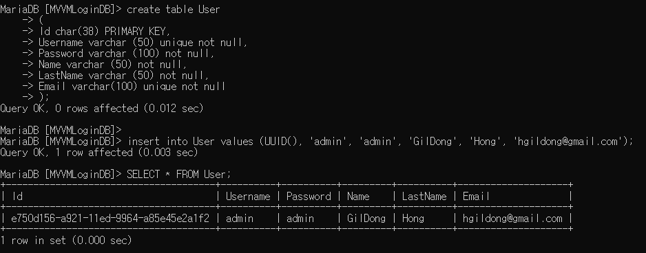

MySql에서 고유한 아이디 값을 생성하는 방법 

`UUID()`를 사용하기 위해선 UniqueIdentifier의 길이가 38자이므로 `CAR(38)` 유형의 필드를 만들어 사용해야 한다.


```SQL
// TABLE SCHEMA
CREATE TABLE User
(
	Id char(38) PRIMARY KEY,
	Username varchar (50) unique not null,
	Password varchar (100) not null,
	Name varchar (50) not null,
	LastName varchar (50) not null,
	Email varchar(100) unique not null
);

---
// Insert
INSERT INTO User VALUES (UUID(), 'admin', 'admin', 'GilDong', 'Hong', 'hgildong@gmail.com');

```



[참고한 사이트](https://www.aspsnippets.com/questions/185273/Solved-How-to-use-UniqueIdentifier-data-type-in-MySql-database/)
